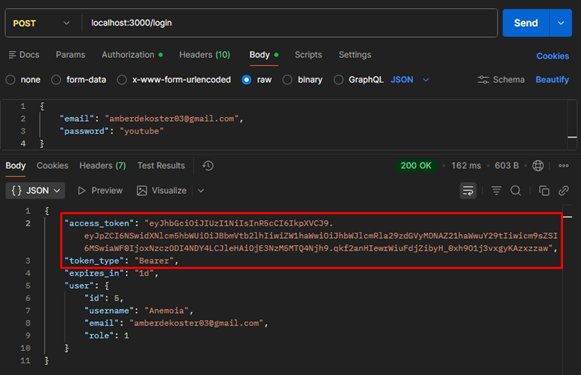
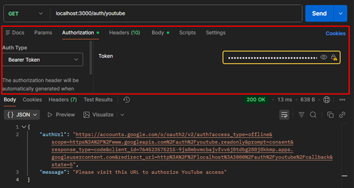
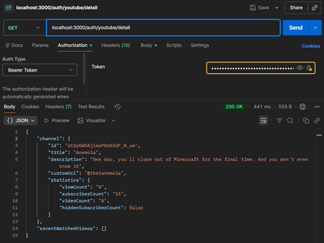
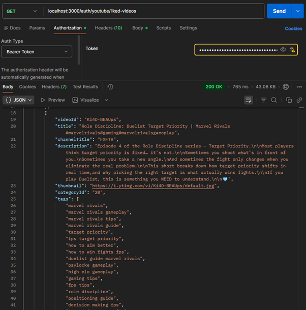
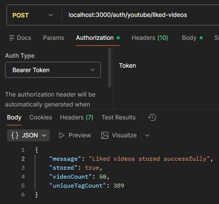
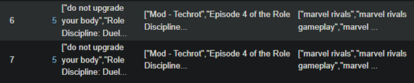
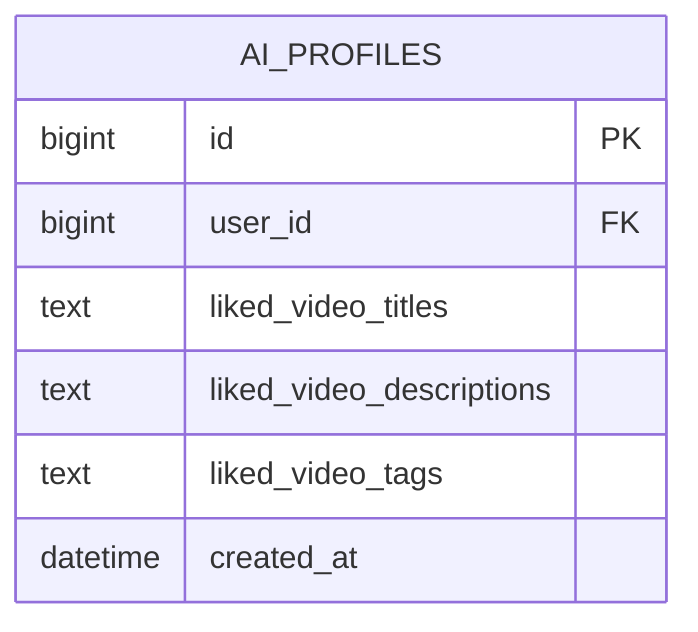
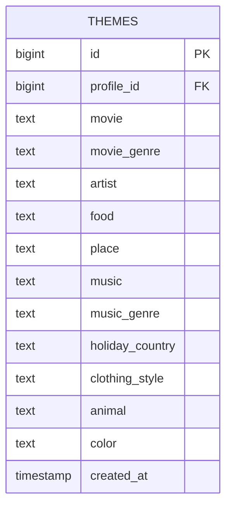

## 🎯 Project Overview

Know your AI API is a RESTful backend that collects user activity via the YouTube Data API and transforms it into an AI-generated profile using Hugging Face models.

The goal?
👉 Help users understand how their data is interpreted by AI systems—and expose the gap between perception and reality.

## ✨ Key Features

- 🔐 Authentication & Authorization

    - JWT-based login system

    - Role-based access control (admin/user)

- 🧠 AI Profile Generation

    - Import YouTube data

    - Generate behavioral themes via Hugging Face

- 🎮 Interactive Learning

    - Create and manage quizzes (learning modules)

    - Multiplayer minigame system (matches & sessions)

- 👨‍👩‍👧 Family System

    - Group users into families

    - Shared learning experiences

- 📊 Data Transparency

    - Expose collected data (read-only endpoints)

    - Let users explore their own AI profiles

## 🏗️ Tech Stack

| Layer        | Technology            |
| ------------ | --------------------- |
| Backend      | Node.js + Express     |
| Database     | MySQL2                |
| AI Service   | Python + Hugging Face |
| Auth         | JWT                   |
| External API | YouTube Data API      |

## ⚙️ Installation & Setup

📦 Prerequisites

- Node.js ≥ 18.x

- npm or yarn

- MySQL / phpMyAdmin

- Git

📥 1. Clone the Repository

```bash
git clone https://github.com/Frutiger-Aero/TLE-3-backend.git
cd TLE-3-back-end
```

📦 2. Install Dependencies

```bash
npm install
```

📦 3. Set up the Database

- Create a MySQL database.
- Import the provided SQL schema into your MySQL server (e.g., via phpMyAdmin or MySQL CLI).

🔐 4. Environment Variables

Create a .env file in the root directory:

```bash
# Database
DB_HOST=
DB_USER=
DB_PASSWORD=
DB_NAME=

# Auth
JWT_SECRET=
JWT_EXPIRES_IN=

# YouTube OAuth
YOUTUBE_CLIENT_ID=
YOUTUBE_CLIENT_SECRET=
YOUTUBE_REDIRECT_URI=
```

▶️ 5. Run the Application
```bash
npm run dev
```
## Database Logic

```mermaid
erDiagram
    USERS {
        bigint id PK
        varchar username
        varchar email UK
        varchar password
        bigint role
        bigint family_id FK
        datetime created_at
    }

    FAMILIES {
        bigint id PK
        bigint user_id FK
        bigint family_admin FK
        datetime created_at
    }

    AI_ATTITUDES {
        int id PK
        int life
        int work
        int future
        int opinion
        int score
        int user_id
        datetime created_at
        datetime updated_at
    }

    AI_PROFILES {
        bigint id PK
        bigint user_id FK
        text liked_video_titles
        text liked_video_descriptions
        text liked_video_tags
        datetime created_at
    }

    THEMES {
        bigint id PK
        bigint profile_id FK
        text movie
        text movie_genre
        text artist
        text food
        text place
        text music
        text music_genre
        text holiday_country
        text clothing_style
        text animal
        text color
        timestamp created_at
    }

    QUIZZES {
        bigint id PK
        varchar name
        bigint theme_id FK
        bigint times_played
        datetime created_at
        text description
    }

    QUESTIONS {
        bigint id PK
        bigint quiz_id FK
        text description
        datetime created_at
    }

    ANSWERS {
        bigint id PK
        bigint question_id FK
        boolean is_correct
        datetime created_at
        bigint user_id FK
    }

    FAMILY_QUIZZES {
        bigint id PK
        bigint family_id FK
        bigint quiz_id FK
        datetime created_at
    }

    LOGS {
        bigint id PK
        bigint user_id FK
        varchar action
        datetime timestamp
    }

    MINIGAMES {
        bigint id PK
        varchar name
        text description
        datetime created_at
        bigint theme_id FK
        varchar game_type
    }

    MINIGAME_MATCHES {
        bigint id PK
        bigint minigame_id FK
        varchar status
        varchar join_code
        bigint created_by_user_id FK
        datetime created_at
        datetime ended_at
    }

    MATCH_USERS {
        bigint id PK
        bigint match_id FK
        bigint user_id FK
        bigint team
        boolean is_host
        datetime joined_at
        datetime left_at
    }

    MINIGAME_SESSIONS {
        bigint id PK
        bigint minigame_id FK
        bigint user_id FK
        datetime start_time
        datetime end_time
        time duration
        bigint score
        json result
        bigint match_id FK
    }

    MINIGAME_EVENTS {
        bigint id PK
        bigint session_id FK
        enum event_type
        json event_data
        datetime timestamp
    }

    RECOMMENDATIONS {
        bigint id PK
        bigint user_id FK
        bigint minigame_id FK
        bigint quiz_id FK
        text recommendation
        text explanation
        decimal confidence_score
        boolean response
        datetime created_at
    }

    USER_MINIGAMES {
        bigint id PK
        bigint user_id FK
        bigint family_id FK
        bigint minigame_id FK
        datetime created_at
    }

    YOUTUBE_TOKENS {
        bigint id PK
        bigint user_id FK
        text access_token
        text refresh_token
        varchar youtube_channel_id
        varchar youtube_channel_name
        datetime created_at
        datetime updated_at
    }

    %% Explicit foreign-key relationships
    USERS o|--|| FAMILIES : "family_id -> id"
    FAMILIES ||--o{ USERS : "id <- family_id"

    USERS ||--o{ AI_PROFILES : "id <- user_id"
    AI_PROFILES o|--o{ THEMES : "id <- profile_id"

    THEMES ||--o{ QUIZZES : "id <- theme_id"
    THEMES ||--o{ MINIGAMES : "id <- theme_id"

    QUIZZES ||--o{ QUESTIONS : "id <- quiz_id"
    QUESTIONS ||--o{ ANSWERS : "id <- question_id"
    USERS o|--o{ ANSWERS : "id <- user_id"

    FAMILIES ||--o{ FAMILY_QUIZZES : "id <- family_id"
    QUIZZES ||--o{ FAMILY_QUIZZES : "id <- quiz_id"

    USERS ||--o{ LOGS : "id <- user_id"

    MINIGAMES ||--o{ MINIGAME_MATCHES : "id <- minigame_id"
    USERS ||--o{ MINIGAME_MATCHES : "id <- created_by_user_id"

    MINIGAME_MATCHES ||--o{ MATCH_USERS : "id <- match_id"
    USERS ||--o{ MATCH_USERS : "id <- user_id"

    MINIGAMES ||--o{ MINIGAME_SESSIONS : "id <- minigame_id"
    USERS ||--o{ MINIGAME_SESSIONS : "id <- user_id"
    MINIGAME_MATCHES o|--o{ MINIGAME_SESSIONS : "id <- match_id"

    MINIGAME_SESSIONS ||--o{ MINIGAME_EVENTS : "id <- session_id"

    USERS ||--o{ RECOMMENDATIONS : "id <- user_id"
    MINIGAMES o|--o{ RECOMMENDATIONS : "id <- minigame_id"
    QUIZZES o|--o{ RECOMMENDATIONS : "id <- quiz_id"

    USERS ||--o{ USER_MINIGAMES : "id <- user_id"
    FAMILIES ||--o{ USER_MINIGAMES : "id <- family_id"
    MINIGAMES ||--o{ USER_MINIGAMES : "id <- minigame_id"

    USERS ||--o{ YOUTUBE_TOKENS : "id <- user_id"

    USERS ||--o{ FAMILIES : "id <- user_id"
    USERS ||--o{ FAMILIES : "id <- family_admin"

    %% Inferred only: indexed column, but no actual FK constraint in dump
    USERS ||--o{ AI_ATTITUDES : "inferred: id <- user_id"
   ```


## API Endpoints

[Download the Postman collection](documents/full_postman_collection.json)
1. Open Postman
2. Click Import
3. Drag & Drop file (or select it)
4. Set:
   ```bash
    - baseUrl (e.g. http://localhost:3000)

    - token after login
    ```

### Authentication & Login
- `POST /login` - User login (returns JWT token)

### Users
- `GET /users` - Get all users
- `POST /users` - Create new user
- `GET /users/:id` - Get user detail (requires auth)
- `PATCH /users/:id` - Update user (requires auth)
- `OPTIONS /users` - Get allowed methods
- `OPTIONS /users/:id` - Get allowed methods

### Admin
- `GET /admin` - Admin dashboard (requires auth + admin role)
- `GET /admin/users` - Get all users with details (requires auth + admin role)

### Families
- `GET /families` - Get all families
- `POST /families` - Create family
- `GET /families/:id` - Get family detail (requires auth)
- `PATCH /families/:id` - Update family
- `DELETE /families/:id` - Delete family
- `OPTIONS /families/:id` - Get allowed methods

### Learning Modules (Quizzes)
- `GET /learningModules` - Get all learning modules/quizzes
- `POST /learningModules` - Create new learning module
- `GET /learningModules/:id` - Get learning module detail
- `PUT /learningModules/:id` - Update learning module
- `DELETE /learningModules/:id` - Delete learning module
- `OPTIONS /learningModules` - Get allowed methods
- `OPTIONS /learningModules/:id` - Get allowed methods

### Minigame Matches
- `POST /minigame-matches` - Create minigame match
- `POST /minigame-matches/join` - Join a minigame match
- `GET /minigame-matches/:id/players` - Get players in a match
- `POST /minigame-matches/:id/start` - Start a match (requires auth)
- `POST /minigame-matches/:id/guess` - Submit a guess in match
- `GET /minigame-matches/:id/state` - Get match state

### Minigame Sessions
- `POST /minigame-sessions` - Create minigame session
- `GET /minigame-sessions/:id` - Get session detail
- `POST /minigame-sessions/:id/guess` - Submit guess in session

### AI & Theme Generation
- `POST /ai/generate` - Generate AI themes (requires auth)
- `GET /ai/me` - Get user's generated themes (requires auth)

### YouTube Integration
- `GET /auth/test-callback` - Test endpoint
- `GET /auth/youtube` - Initiate YouTube OAuth flow (requires auth)
- `GET /auth/youtube/callback` - OAuth callback from Google
- `GET /auth/youtube/status` - Get YouTube connection status (requires auth)
- `GET /auth/youtube/detail` - Get detailed YouTube data (requires auth)
- `GET /auth/youtube/liked-videos` - Get liked videos playlist (requires auth)
- `POST /auth/youtube/liked-videos` - Store liked videos to database (requires auth)

### Data Access (Read-only collections)
- `GET /users` - Get all users
- `GET /ai_profiles` - Get all AI profiles
- `GET /themes` - Get all themes
- `GET /families` - Get all families
- `GET /recommendations` - Get all recommendations
- `GET /logs` - Get all logs
- `GET /family_quizzes` - Get all family quizzes
- `GET /quizzes` - Get all quizzes
- `GET /minigame_matches` - Get all minigame matches
- `GET /minigame_sessions` - Get all minigame sessions
- `GET /youtube_data` - Get all YouTube data
- `OPTIONS /` - Get allowed methods

## Project Structure

```
src/
├── api/
├── controllers/
├── documents/
├── hf_ai/
├── middleware/
├── models/
├── routes/
├── services/  
├── .env
├── .gitignore
├── database.js
├── index.js
├── package.json
├── package-lock.json
├── README.md
```
## Deployment
1. Host the project on a server (e.g., Heroku, AWS, DigitalOcean, VPS)
2. Install node, express and MySQL2 on the server
3. Import the database to the server's MySQL instance
4. Set environment variables on the server
5. Start the server with `node index.js` or `npm run dev`

## YouTube Verification

This step only works on localhost, so you can test it during development. For production, you would need to set up a proper domain and SSL certificate.

- To verify a user with the YouTube API, they must first be logged in. When a user logs in, this user creates a JWT token. This JWT token is needed for authentication.



- After this, you make a GET request to auth/youtube, in which you receive a link to the verification page and a response message; for this, the JWT token must be provided for authentication.




- Link the user to this URL. You will then go through the typical workflow of linking your Google account with an app.

### Retrieve YouTube channel data

- When a user is logged in, and this user has already linked with YouTube, you can retrieve data from his/her YouTube channel via a GET request to auth/youtube/detail. The JWT token is also required here.



### Fetch YouTube liked videos

-In the same way as the channel data, you can retrieve the 10 most recent liked videos of a user by making a GET request to auth/youtube/liked-videos. Here too, the JWT token is required.



### Save data liked videos to AI Profile.

-If you do a POST instead of a GET on auth/youtube/liked-videos, it then posts an array of the titles, descriptions, and video tags to the ai_profiles table in the database. Again, the JWT token is required for this.



-This also keeps track of whether the user had previously stored their liked videos. This can be seen from the “stored” value; if it is true, then the user was already known in the database and a new selection of liked videos has been saved.



-There will be another filter for ai_profiles that allows you to filter by tags, so that you can overwhelm a user with the number of tags attached to videos that an AI can have access to.

## HuggingFace AI Theme Generator
### 1. Overview
The application generates user interests (themes) based on YouTube data linked to a user.
The data is stored in the ai_profiles table and contains information about videos a user has liked.
This data is then analyzed by an AI model via Hugging Face (CohereLabs/tiny-aya-water).
The model generates themes from this, which are stored in the themes table.
These themes represent the user's interests and preferences.

- Examples of generated themes:

  • favorite movie <br>
  • movie genre <br>
  • music genre <br>
  • artist <br>
  • favorite color <br>
  • clothing style <br>
  • vacation country

### 2. Database Structure

The AI_PROFILES table contains YouTube data from the user. It forms the input for the AI analysis.


The THEMES table contains the generated interests of the user.



### 3. AI Integration
For the analysis of user data, the following is used:

#### Hugging Face Inference API
- Model:<br>
  CohereLabs/tiny-aya-water <br>

This model receives profile data and generates a JSON object with themes.

- Example prompt: <br>
  You are an assistant that converts user interests into themes.<br>
  Analyze the following ai_profile and return only valid JSON.<br>
  Use these keys:

movie <br>
movie_genre <br>
artist <br>
food <br>
place <br>
music <br>
music_genre <br>
holiday_country <br>
clothing_style <br>
animal <br>
color <br>

#### Example output

```json
{
  "movie": "Harry Potter",
  "movie_genre": "fantasy",
  "artist": "Taylor Swift",
  "food": "pizza",
  "place": "beach",
  "music": "pop",
  "music_genre": "pop",
  "holiday_country": "Italy",
  "clothing_style": "casual",
  "animal": "cat",
  "color": "blue"
}
```
### 4. API Endpoints

#### Generate Themes
Generates themes based on the AI profile.

#### Flow
1. User is logged in
2. req.user.id is retrieved
3. AI profile is retrieved from the database
4. Profile data is sent to Hugging Face
5. AI generates themes
6. Themes are saved in themes

#### Request
POST /ai/generate
##### Response

```json
{
  "message": "Themes generated",
  "themes": {
    "movie": "Harry Potter",
    "movie_genre": "fantasy",
    "artist": "Taylor Swift"
  }
}
``` 

#### Get Themes
Retrieves the generated themes of the logged-in user.<br>
GET /themes?id=[PROFILE_ID]
##### Flow
• Retrieve req.user.id <br>
• Find profile <br>
• Retrieve themes <br>
#### Response

```json
 {
  "profile_id": 1,
  "movie": "Harry Potter",
  "music_genre": "pop",
  "color": "blue"
}
``` 

### 5. Service Layer

The `themeGenerate` contains the business logic.

#### Functions

| Function                      | Description                          |
|------------------------------|--------------------------------------|
| `getAiProfile()`             | Retrieves the AI profile             |
| `generateThemesFromProfile()`| Performs AI-based analysis           |
| `saveThemes()`               | Persists generated themes            |
| `generateThemesForUser()`    | Executes the full theme generation flow |

### 6. Database Queries

For database interaction, `mysql2` is used.

#### Example Query

```js
await db.query(
  `INSERT INTO themes SET ?, timestamp = NOW()`,
  [
    {
      profile_id: profileId,
      ...themes
    }
  ]
);
```

### 7. Security

The following security measures are implemented:

#### Environment Variables

API tokens and database credentials are stored in a `.env` file.

**Example:**
```env
HF_TOKEN=xxxxx
DB_HOST=localhost
DB_USER=root
DB_PASSWORD=password
DB_NAME=project
```

Endpoints use an authentication middleware that sets req.user.

- req.user.id identifies which user is performing the request.

- This ensures actions are always tied to an authenticated user.
-
### 8. Error Handling

The application includes basic error handling.

#### Examples

| Error                     | Response Code |
|--------------------------|---------------|
| Profile not found        | 404           |
| Invalid AI response      | 500           |
| Database error           | 500           |

### Example

```js
if (!profile) {
  return res.status(404).json({
    error: "AI profile not found."
  });
}
```

### 9. Future Improvements

The following enhancements are possible:

#### YouTube Analysis

The AI can be extended to analyze YouTube data, such as:

- Watched videos
- Subscriptions
- Playlists

This data can be incorporated into the AI prompt to improve personalization.

#### Improved AI Models

The current model (Tiny-Aya-Water) is relatively small. In the future, it can be replaced with more advanced models, such as:

- Llama 3
- Mistral
- OpenAI models

This can significantly improve the quality of theme analysis.

#### Caching

To reduce costs and latency, caching can be introduced:

- Redis for fast data access
- Storing AI responses to avoid repeated processing

#### Enabling API Keys

We've already implemented the functionality to use API keys for authentication. This can be enabled in the future to allow third-party applications to access the theme generation service securely.
### 10. Summary

The AI Theme Generator:

1. Collects user data
2. Creates an AI profile
3. Analyzes the profile using a Hugging Face model
4. Generates themes
5. Stores the themes in the database
6. Exposes the themes via an API

This system enables the generation of personalized insights based on user behavior.

## Edge Cases
### Environment & Configuration Issues
- Missing or Incomplete .env File, User misses variables or forgets to create .env entirely, leading to application failure.
- Database Connection Failures, Incorrect credentials or database server issues can prevent the app from connecting to the database.
- Node.js Version Incompatibility, Running the app on an unsupported Node.js version can cause unexpected errors.
### Database Schema Issues
- Schema Import Problems, Errors during database import (e.g., syntax errors, missing tables) can lead to a non-functional database.
- Existing Data Conflicts, If the database already contains data that conflicts with the expected schema (e.g., duplicate entries), it can cause issues during app operation.
### Authentication & API Issues
- Youtube OAuth Failures, Users may encounter issues during the YouTube OAuth flow, such as denied permissions or callback errors.
- Hugging Face API Issues, Problems with the Hugging Face API (e.g., rate limits, downtime) can disrupt theme generation.
- JWT Token Issues, Expired or malformed JWT tokens can lead to authentication failures.
### Network & Port Issues
- Port Conflicts, If port 8000 is already in use, the app will fail to start.
- API Key Middleware Bug, If the API key middleware is enabled but not properly configured, it can block all requests or allow unauthorized access.
### Request/Response Issues
- Missing Accept Header, If the client does not send an Accept header, the server may not know how to respond properly.
- Large Payload Issues, Sending large requests (e.g., large AI profiles) may cause timeouts or memory issues.
### File System Issues
- Relative Path Problems, If the env file is put in the wrong directory, or the app is run through linux, it may not be able to find the .env file due to path issues.
### Dependancy Issues
- Package Installation Failures, Issues during npm install (e.g., network problems, incompatible package versions) can prevent the app from running.
- Missing Optional Dependencies, If optional dependencies (e.g., for AI integration) are not installed, certain features may not work.
### Data Integrity Issues
- Concurrent YouTube Data Fetching, If multiple requests to fetch YouTube data for the same user occur simultaneously, it may lead to race conditions and inconsistent database state.
- Partial Data Storage, If an error occurs while saving AI profiles or themes, it may result in incomplete data being stored in the database.
